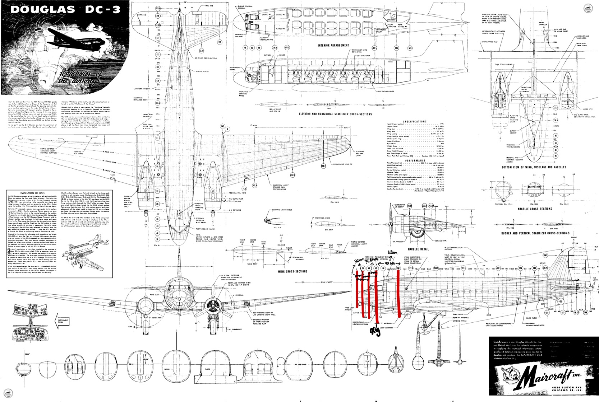
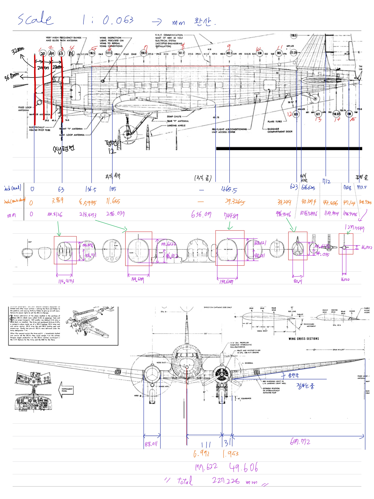
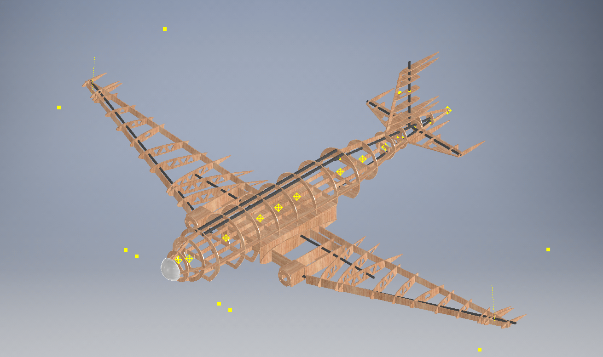
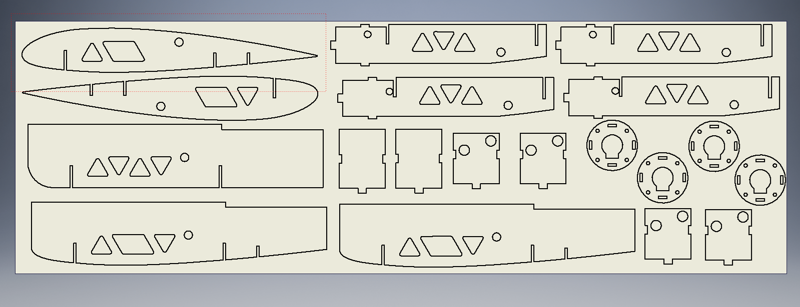
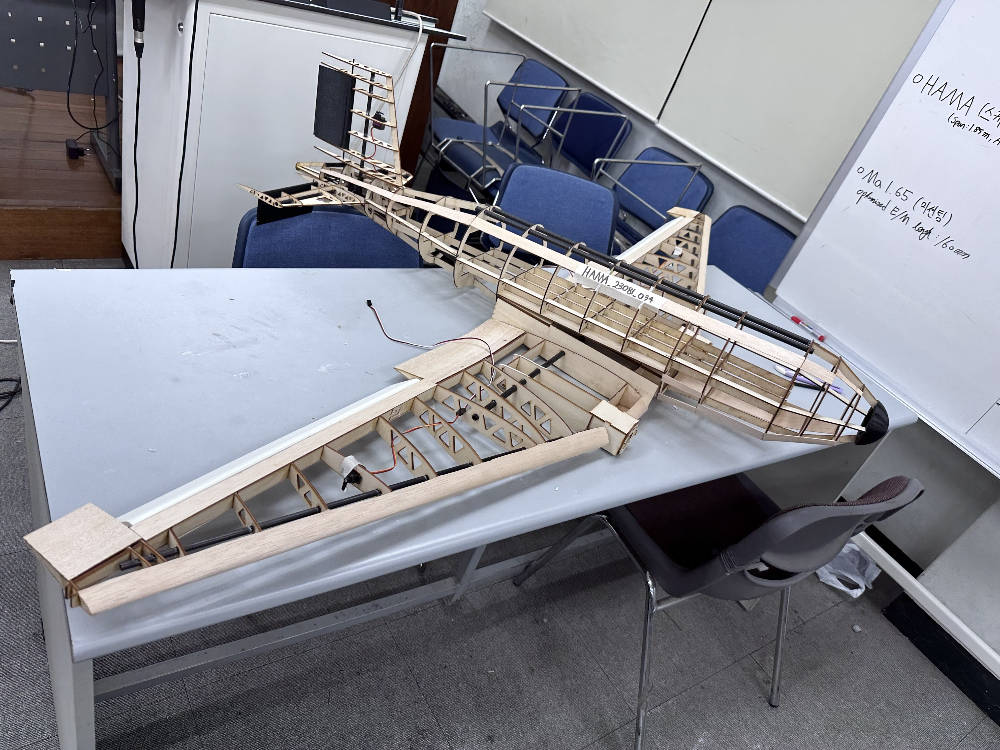
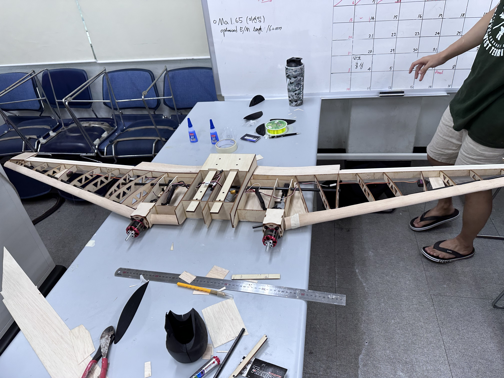
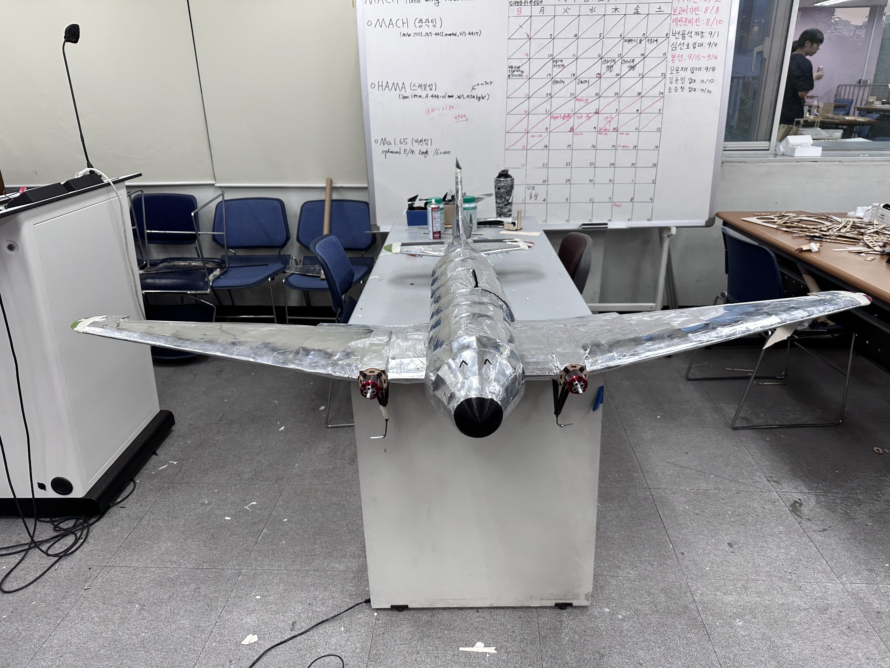

<nav style="text-align:center; margin-bottom:20px;">
  <a href="index.html">Home</a> |
  <a href="projects.html">Projects</a> |
  <a href="research-interests.html">Research</a> |
  <a href="contact.html">Contact</a>
</nav>

# Fixed-Wing Aircraft Design for National Aerobatic Competition

This project represents my first visceral encounter with the 'Gap' between an ideal model and messy reality. Growing up near an air force base, I was captivated by the flawless flight of fighter jets. This project was my attempt to recreate that perfection, and its challenges ultimately guided me toward the deep questions of control engineering.

---

### What: The Challenge
As the leader of a 4-member team in the Chung-Ang Aerospace Club, the challenge was to navigate the complete design-build-test lifecycle of a 1.6m wingspan fixed-wing aircraft. The goal was to compete in the Pusan National University President’s Cup (부산대 총장 배 창의비행체 경진대회 고정익 스케일기 부문), a national-level competition requiring both high-speed stability and low-speed maneuverability for aerobatic flight.

---

### How: Leading the Project Lifecycle from Blueprint to Flight

My role was to direct the team through a systematic engineering process, from initial analysis of historical blueprints to hands-on fabrication and final flight testing.

#### 1. Reference Analysis & Sizing
Our design was inspired by the classic Douglas DC-3. The first step was a meticulous analysis of its original blueprints to extract key aerodynamic and structural parameters, which were then scaled down for our 1.6m wingspan model.

*
Fig 1. Analyzing original Douglas DC-3 blueprints to establish baseline design parameters.
*

*
Fig 2. Scaling down the dimensions from the original schematics to fit our 1.6m wingspan target.
*

#### 2. CAD Modeling & Digital Fabrication
Using SolidWorks and AutoCAD, I translated our analysis into a high-fidelity 3D model and prepared the components for manufacturing. This digital phase was critical for ensuring precision and optimizing the airframe structure before any physical materials were cut.

*
Fig 3. The complete 3D CAD assembly, validating the structural integrity of the design.
*

*
Fig 4. 2D layouts derived from the 3D model, prepared for high-precision laser cutting.
*

#### 3. Physical Assembly & Systems Integration
I managed the entire fabrication and assembly process, leading the team as we brought the digital model to life. This involved meticulous hands-on work, from constructing the balsa wood frame to integrating all electronic systems.

*
Fig 5. The aircraft's skeleton takes shape during the assembly phase.
*

*
Fig 6. Integrating servos and electronic systems into the main wing structure.
*

*
Fig 7. The completed aircraft, fully assembled and ready for flight testing.
*

---

### Why: A Formative Success and a Deeper Question
This project was both a tangible success and a pivotal learning experience that shaped my academic ambitions.

#### Final Flight & Competition Result
Our team's efforts culminated in a **4th place finish** in the Fixed-Wing Scale Aircraft Division, a significant achievement in a national-level competition. The aircraft successfully executed all planned aerobatic maneuvers.

  

    

      <video
        controls
        playsinline
        preload="metadata"
        style="position:absolute; top:0; left:0; width:100%; height:100%;"
        poster="assets/fixed_wing_thumb.jpg">
        <!-- MP4 우선 (Safari 호환) -->
        <source src="videos/fixed_wing_flight.mp4?v=1" type="video/mp4">
        Your browser does not support the video tag.
      </video>
    

  

  
<i>Video 1. Final flight test and aerobatic maneuvers at the competition.</i>

#### Lessons Learned
When our meticulously designed aircraft faced unpredictable disturbances and deviated from its planned path, I viscerally experienced the gap between theory and practice. This moved me beyond hardware fabrication and ignited my passion for control engineering—the art of understanding and mastering the unseen forces that govern a system's behavior. This project taught me that the real engineering challenge lies not just in creating an ideal model, but in making that model robust to the chaotic reality of the physical world.

---

<nav style="text-align:center; margin-top:20px;">
  <a href="projects.html">⬅ Back to Projects</a> | 
  <a href="index.html">⬅ Back to Home</a> | 
  <a href="QATT-project.html">⬅ Previous Project: QATT</a> | 
  <a href="research-interests.html">Research</a> | 
  <a href="contact.html">Contact</a>
</nav>
