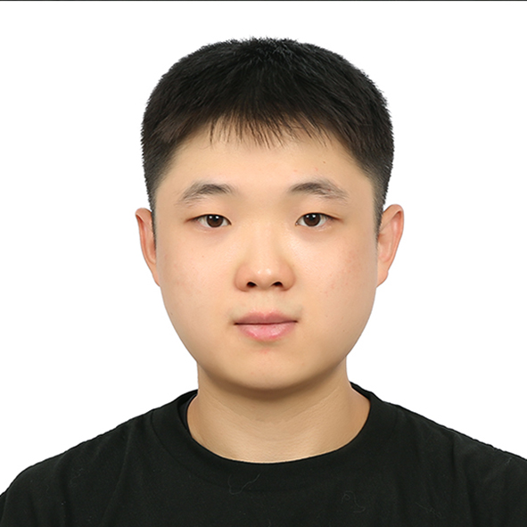

# Hojun Kim's Career Portfolio

  

## About Me
I am Hojun Kim, originally from South Korea, and currently pursuing a B.S. in Mechanical Engineering with a Mathematics minor at Northeastern University (Class of 2026).  
After completing two years at Chung-Ang University in Seoul, I transferred to Northeastern to deepen my studies in dynamics, control, and robotics.  

My academic journey has been shaped by both discipline and curiosity: from leading a UAV team during my undergraduate years, to conducting self-initiated research on quadrotor aggressive trajectory tracking (QATT). These experiences have taught me the importance of robust autonomy in unpredictable environments.  

- **Education**: B.S. in Mechanical Engineering, Northeastern University | Class of 2026
- **Interests**: Uncertainty Quantification | Nonlinear control | Motion Planning | [Robust Control](research-interests.html)
- **Contact**: your-email@email.com | [LinkedIn Profile](https://www.linkedin.com/)

## Professional Goals
My goal is to pursue a Ph.D. in Mechanical/Aerospace Engineering, focusing on advanced control theories for autonomous systems. 
Beyond the Ph.D., I aspire to continue research in robotics and aerospace, contributing to safe and intelligent autonomous systems.  

---
### My Projects
[Click here to view my key projects](projects.html)
